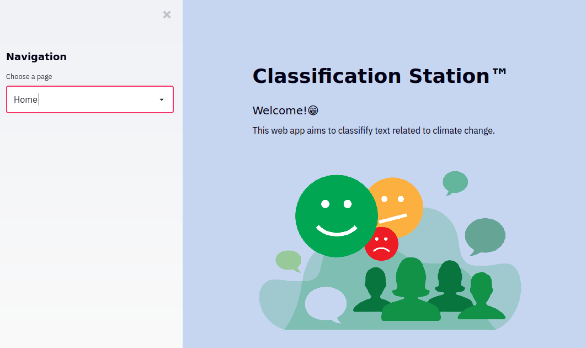

# Streamlit-based Web Application
#### EXPLORE Data Science Academy Classification Predict


## 1) Usage Instructions

#### 1.2) Running the Streamlit web app on your local machine

 1. Ensure that you have the prerequisite Python libraries installed on your local machine:

 ```bash
 pip install -U streamlit numpy pandas scikit-learn
 ```

 2. Clone the repo to your local machine.

 ```bash
 git clone https://github.com/hesterstofberg/classification-predict-streamlit-template.git
 ```  

 3. Navigate to the base of the cloned repo, and start the Streamlit app.

 ```bash
 cd classification-predict-streamlit-template/
 streamlit run base_app.py
 ```

 If the web server was able to initialise successfully, the following message should be displayed within your bash/terminal session:

```
  You can now view your Streamlit app in your browser.

    Local URL: http://localhost:8501
    Network URL: http://192.168.43.41:8501
```

You should also be automatically directed to the base page of your web app. This should look something like:



You can now interact with the web app, enjoy!
